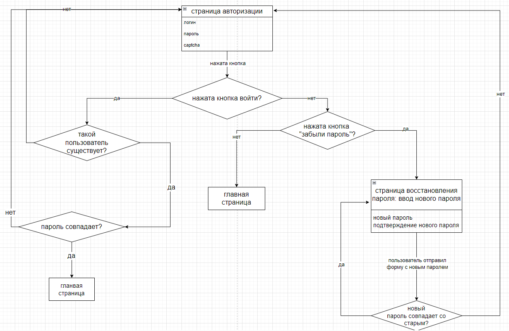

## Описание 

Проект представляет собой страницу авторизации для книжного магазина, а также страницу восставноления пароля.

### Функциональные требования для страницы авторизации: 
- Форма входа должна предоставлять пользователю возможность авторизоваться в системе с помощью email/номера телефона и пароля.
- Система должна проверять соответствие email правильному формату адреса электронной почты.
- Система должна проверять правильность формата номера телефона.
- Форма должна сообщать пользователю о несоответствии введенных данных указанному формату.
- Форма должна предоставлять пользователю возможность увидеть/скрыть пароль.
- Кнопка целевого действия должна быть недоступной до тех пор, пока пользователь не введет корректные данные.
- Система должна проверять соответствие введенных данных и записей в базе и сообщаться пользователю, если он указал неверный логин или пароль.
- Страница должна содержать ссылку на страницу восстановления пароля.
- Страница должна содержать ссылку на страницу регистрации.
- После авторизации система должна перенаправить пользователя на главную страницу.
- Пользователь должен иметь возможность оставаться в системе без повторного ввода учетных данных при последующих посещениях сайта.
- После нескольких неудачных попыток входа система должна блокировать возможность входа на аккаунт на 10 минут. 13. Если пользователь уже авторизован в системе, он должен иметь возможность деавторизоваться.
### Функциональные требования к странице восстановления пароля 
- Форма должна предоставлять пользователю возможность восстановить пароль с помощью его email.
- Форма должна требовать обязательного заполнения поля email перед отправкой запроса на восстановление.
- Система должна проверять соответствие email правильному формату адреса электронной почты и сообщать об ошибке, если формат неверный.
- Система должна проверять наличие введенного email в базе данных.
- Страница должна содержать ссылку на страницу авторизации.
- Кнопка целевого действия должна быть недоступна, пока пользователь не введет email, соответствующий правильному формату. Форма должна сообщать пользователю, если его email не был найден в базе данных.
- После отправки успешного запроса система должна предоставить пользователю возможность сменить пароль.
- Форма смены пароля должна содержать два обязательных поля: "Новый пароль" и "Повторите пароль".
- Форма должна проверять, что пользователь ввел одинаковые данные.
- Форма должна требовать соответствия нового пароля формату, определенному командой регистрации.
- Форма должна информировать пользователя, если его пароль не соответствует установленному формату.
- Система должна проверить, что новый пароль не совпадает со старым.
- Кнопка целевого действия должна быть недоступной до тех пор, пока пользователь не введет обязательные данные.
- После успешной смены пароля страница должна информировать пользователя об этом.
- После смены пароля система должна обновить запись в базе данных, связанную с аккаунтом пользователя.
- После смены пароля страница должна содержать ссылку на страницу авторизации.

### Схема пользовательского пути

### Страница с авторизацией

### Страница с восстановлением пароля

[Ссылка](https://vlg-ivtb1.youtrack.cloud/articles/AUTH-A-6/test-kejsy-dizajn) на тест кейсы дизайна и описание всех состояний 
